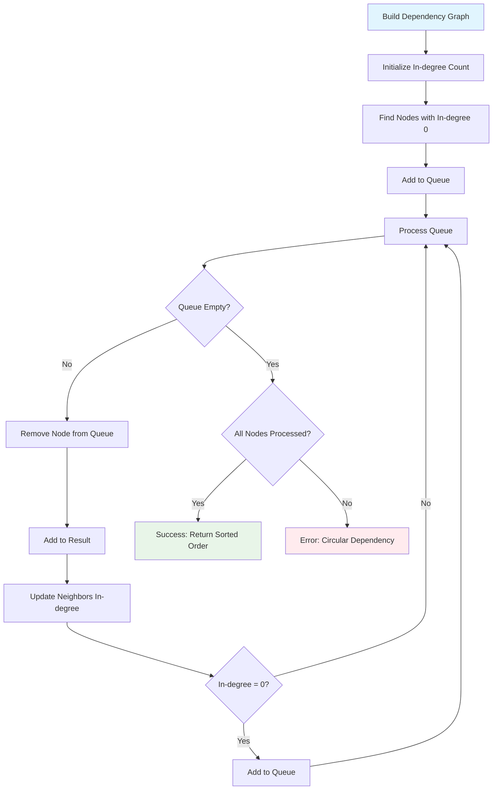
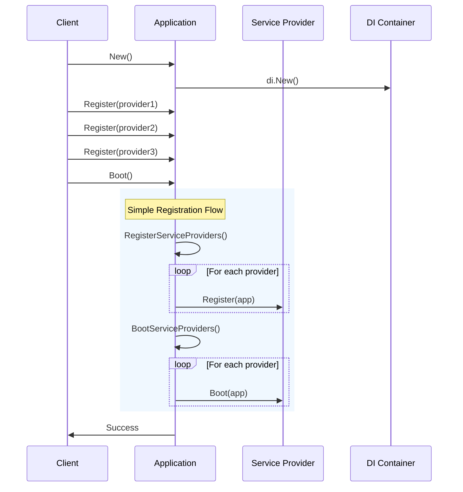
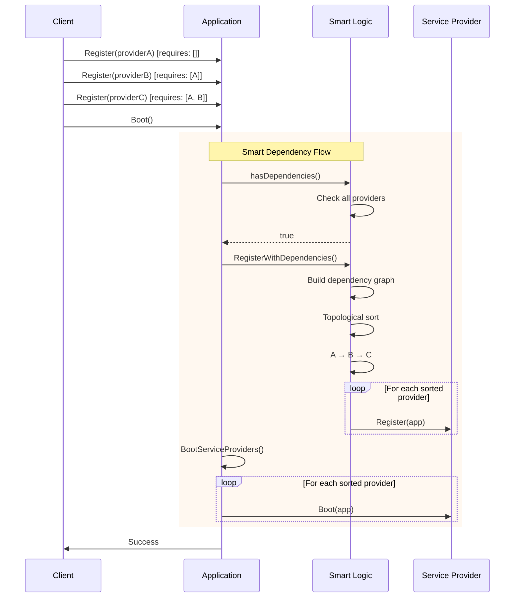

# Application - Core Interface & Implementation

## 🎯 Tổng quan

`Application` là interface trung tâm của go.fork.vn/core, định nghĩa contract cho việc quản lý ứng dụng với dependency injection, service provider lifecycle và smart dependency management.

## 📋 Interface Definition

```go
type Application interface {
    // Container access
    Container() di.Container
    
    // Service Provider lifecycle management
    Register(provider di.ServiceProvider)
    RegisterServiceProviders() error
    RegisterWithDependencies() error  // 🆕 Smart dependency ordering
    BootServiceProviders() error
    Boot() error                      // 🆕 Auto-detection workflow
    
    // Binding shortcuts for direct container access
    Bind(abstract string, concrete di.BindingFunc)
    Singleton(abstract string, concrete di.BindingFunc)
    Instance(abstract string, instance interface{})
    Alias(abstract, alias string)
    
    // Dependency resolution
    Make(abstract string) (interface{}, error)
    MustMake(abstract string) interface{}
    Call(callback interface{}, params ...interface{}) ([]interface{}, error)
}
```

## 🏗️ Implementation Structure

```mermaid
classDiagram
    class Application {
        <<interface>>
        +Container() Container
        +Register(provider)
        +RegisterServiceProviders() error
        +RegisterWithDependencies() error
        +BootServiceProviders() error
        +Boot() error
        +Bind(abstract, concrete)
        +Singleton(abstract, concrete)
        +Instance(abstract, instance)
        +Alias(abstract, alias)
        +Make(abstract) (interface{}, error)
        +MustMake(abstract) interface{}
        +Call(callback, params...) ([]interface{}, error)
    }
    
    class application {
        -container: Container
        -providers: map[string]ServiceProvider
        -sortedProviders: []ServiceProvider
        -booted: bool
        -mu: sync.RWMutex
        +hasDependencies() bool
        +getProviderKey(provider) string
    }
    
    Application <|-- application
    
    application --> Container : uses
    application --> ServiceProvider : manages
```

## 🚀 Core Methods

### 1. **Constructor**

```go
func New() Application {
    return &application{
        container: di.New(),
        providers: make(map[string]di.ServiceProvider),
        booted:    false,
    }
}
```

**Mục đích**: Tạo instance Application mới với DI container rỗng.

### 2. **Container Access**

```go
func (a *application) Container() di.Container {
    return a.container
}
```

**Mục đích**: Truy cập trực tiếp DI container để thao tác binding/resolution.

### 3. **Service Provider Registration**

#### Basic Registration
```go
func (a *application) Register(provider di.ServiceProvider) {
    a.mu.Lock()
    defer a.mu.Unlock()
    
    key := a.getProviderKey(provider)
    a.providers[key] = provider
}
```

#### Smart Registration với Dependencies
```go
func (a *application) RegisterWithDependencies() error {
    a.mu.Lock()
    defer a.mu.Unlock()
    
    // Build dependency graph
    graph := make(map[string][]string)
    providers := make(map[string]di.ServiceProvider)
    
    for key, provider := range a.providers {
        graph[key] = provider.Requires()
        providers[key] = provider
    }
    
    // Topological sort
    sorted, err := a.topologicalSort(graph)
    if err != nil {
        return err
    }
    
    // Register providers in dependency order
    for _, key := range sorted {
        provider := providers[key]
        provider.Register(a)
    }
    
    // Cache sorted providers
    a.sortedProviders = make([]di.ServiceProvider, len(sorted))
    for i, key := range sorted {
        a.sortedProviders[i] = providers[key]
    }
    
    return nil
}
```

### 4. **Smart Boot Process**

```go
func (a *application) Boot() error {
    a.mu.Lock()
    defer a.mu.Unlock()
    
    if a.booted {
        return nil // Prevent double boot
    }
    
    // Auto-detect dependencies and choose registration method
    if a.hasDependencies() {
        // Use smart dependency-aware registration
        if err := a.RegisterWithDependencies(); err != nil {
            return fmt.Errorf("failed to register providers with dependencies: %w", err)
        }
    } else {
        // Use simple registration for backward compatibility
        if err := a.RegisterServiceProviders(); err != nil {
            return fmt.Errorf("failed to register providers: %w", err)
        }
    }
    
    // Boot all providers
    if err := a.BootServiceProviders(); err != nil {
        return fmt.Errorf("failed to boot providers: %w", err)
    }
    
    a.booted = true
    return nil
}
```

## 🧠 Smart Dependency Management

### Dependency Detection
```go
func (a *application) hasDependencies() bool {
    for _, provider := range a.providers {
        if len(provider.Requires()) > 0 {
            return true
        }
    }
    return false
}
```

### Topological Sort Algorithm


```go
func (a *application) topologicalSort(graph map[string][]string) ([]string, error) {
    // Calculate in-degrees
    inDegree := make(map[string]int)
    allNodes := make(map[string]bool)
    
    for node, deps := range graph {
        allNodes[node] = true
        if _, exists := inDegree[node]; !exists {
            inDegree[node] = 0
        }
        
        for _, dep := range deps {
            allNodes[dep] = true
            inDegree[dep]++
        }
    }
    
    // Find nodes with in-degree 0
    queue := make([]string, 0)
    for node := range allNodes {
        if inDegree[node] == 0 {
            queue = append(queue, node)
        }
    }
    
    // Process queue
    result := make([]string, 0, len(allNodes))
    
    for len(queue) > 0 {
        current := queue[0]
        queue = queue[1:]
        result = append(result, current)
        
        // Update neighbors
        for _, neighbor := range graph[current] {
            inDegree[neighbor]--
            if inDegree[neighbor] == 0 {
                queue = append(queue, neighbor)
            }
        }
    }
    
    // Check for circular dependencies
    if len(result) != len(allNodes) {
        return nil, errors.New("circular dependency detected")
    }
    
    return result, nil
}
```

## 🔄 Lifecycle Workflows

### Standard Boot Flow


### Smart Dependency Flow


## 🔧 Binding Shortcuts

Application cung cấp shortcuts để truy cập trực tiếp các phương thức container:

```go
// Bind - Đăng ký factory function
func (a *application) Bind(abstract string, concrete di.BindingFunc) {
    a.container.Bind(abstract, concrete)
}

// Singleton - Đăng ký singleton binding
func (a *application) Singleton(abstract string, concrete di.BindingFunc) {
    a.container.Singleton(abstract, concrete)
}

// Instance - Đăng ký instance có sẵn
func (a *application) Instance(abstract string, instance interface{}) {
    a.container.Instance(abstract, instance)
}

// Alias - Đăng ký alias cho service
func (a *application) Alias(abstract, alias string) {
    a.container.Alias(abstract, alias)
}
```

### Usage Examples
```go
app := core.New()

// Bind service factory
app.Bind("logger", func(c di.Container) interface{} {
    return log.New(os.Stdout, "APP: ", log.LstdFlags)
})

// Singleton service
app.Singleton("database", func(c di.Container) interface{} {
    config := c.MustMake("config").(Config)
    return database.Connect(config.GetDSN())
})

// Register existing instance
config := &Config{Debug: true}
app.Instance("config", config)

// Create alias
app.Alias("database", "db")
```

## 🔍 Dependency Resolution

### Make - Safe Resolution
```go
func (a *application) Make(abstract string) (interface{}, error) {
    return a.container.Make(abstract)
}

// Usage
logger, err := app.Make("logger")
if err != nil {
    return fmt.Errorf("failed to resolve logger: %w", err)
}
```

### MustMake - Panic on Error
```go
func (a *application) MustMake(abstract string) interface{} {
    return a.container.MustMake(abstract)
}

// Usage
logger := app.MustMake("logger").(log.Logger)
```

### Call - Automatic Dependency Injection
```go
func (a *application) Call(callback interface{}, additionalParams ...interface{}) ([]interface{}, error) {
    return a.container.Call(callback, additionalParams...)
}

// Usage
result, err := app.Call(func(
    config Config,
    logger log.Logger,
    db database.DB,
) error {
    logger.Info("Initializing with config", config.GetAppName())
    return db.Ping()
})
```

## ⚡ Performance Optimizations

### 1. **Zero-allocation Provider Keys**
```go
func (a *application) getProviderKey(provider di.ServiceProvider) string {
    // Use memory address để tránh string allocation và collision
    return fmt.Sprintf("%s@%p", 
        reflect.TypeOf(provider).String(), 
        provider)
}
```

### 2. **Cached Sorted Providers**
```go
type application struct {
    // ...existing fields...
    sortedProviders []di.ServiceProvider  // Cache sorted order
}

func (a *application) BootServiceProviders() error {
    // Use cached sorted providers if available
    providers := a.sortedProviders
    if len(providers) == 0 {
        // Fallback to original providers
        providers = make([]di.ServiceProvider, 0, len(a.providers))
        for _, provider := range a.providers {
            providers = append(providers, provider)
        }
    }
    
    for _, provider := range providers {
        if err := provider.Boot(a); err != nil {
            return err
        }
    }
    return nil
}
```

### 3. **Read-Write Mutex**
```go
type application struct {
    // ...other fields...
    mu sync.RWMutex  // Allow concurrent reads, exclusive writes
}

func (a *application) Make(abstract string) (interface{}, error) {
    // No lock needed - container handles its own synchronization
    return a.container.Make(abstract)
}

func (a *application) Register(provider di.ServiceProvider) {
    a.mu.Lock()  // Exclusive write lock
    defer a.mu.Unlock()
    // ...registration logic...
}
```

## 🧪 Testing Support

### Mock Application
```go
import "go.fork.vn/core/mocks"

func TestMyService(t *testing.T) {
    mockApp := new(mocks.Application)
    
    // Setup expectations
    mockApp.On("MustMake", "config").Return(mockConfig)
    mockApp.On("Boot").Return(nil)
    mockApp.On("RegisterWithDependencies").Return(nil)
    
    // Test with mock
    service := NewMyService(mockApp)
    err := service.Initialize()
    
    assert.NoError(t, err)
    mockApp.AssertExpectations(t)
}
```

### Integration Testing
```go
func TestApplicationIntegration(t *testing.T) {
    app := core.New()
    
    // Register test providers
    app.Register(&TestConfigProvider{})
    app.Register(&TestLogProvider{})
    
    // Test boot process
    err := app.Boot()
    assert.NoError(t, err)
    
    // Test dependency resolution
    config := app.MustMake("config")
    assert.NotNil(t, config)
    
    logger := app.MustMake("log")
    assert.NotNil(t, logger)
}
```

## 🔒 Thread Safety

### Concurrent Registration
```go
func TestConcurrentRegistration(t *testing.T) {
    app := core.New()
    var wg sync.WaitGroup
    
    // Concurrent registration
    for i := 0; i < 100; i++ {
        wg.Add(1)
        go func(id int) {
            defer wg.Done()
            provider := &TestProvider{ID: id}
            app.Register(provider)
        }(i)
    }
    
    wg.Wait()
    
    // All providers should be registered
    err := app.Boot()
    assert.NoError(t, err)
}
```

### Concurrent Resolution
```go
func TestConcurrentResolution(t *testing.T) {
    app := core.New()
    app.Singleton("service", func(c di.Container) interface{} {
        return &TestService{}
    })
    
    var wg sync.WaitGroup
    services := make([]*TestService, 100)
    
    // Concurrent resolution
    for i := 0; i < 100; i++ {
        wg.Add(1)
        go func(idx int) {
            defer wg.Done()
            services[idx] = app.MustMake("service").(*TestService)
        }(i)
    }
    
    wg.Wait()
    
    // All should be the same instance (singleton)
    for i := 1; i < len(services); i++ {
        assert.Same(t, services[0], services[i])
    }
}
```

## 📊 Error Handling

### Registration Errors
```go
// Circular dependency detection
type ProviderA struct{}
func (p *ProviderA) Requires() []string { return []string{"B"} }

type ProviderB struct{}  
func (p *ProviderB) Requires() []string { return []string{"A"} }

app.Register(&ProviderA{})
app.Register(&ProviderB{})

err := app.Boot()
assert.Error(t, err)
assert.Contains(t, err.Error(), "circular dependency detected")
```

### Missing Dependency Errors
```go
type ProviderWithMissingDep struct{}
func (p *ProviderWithMissingDep) Requires() []string { 
    return []string{"non-existent"} 
}

app.Register(&ProviderWithMissingDep{})

err := app.Boot()
assert.Error(t, err)
assert.Contains(t, err.Error(), "dependency not found")
```

### Resolution Errors
```go
// Service not registered
service, err := app.Make("non-existent")
assert.Error(t, err)
assert.Nil(t, service)

// Panic on MustMake
assert.Panics(t, func() {
    app.MustMake("non-existent")
})
```

## 🏆 Best Practices

### 1. **Provider Organization**
```go
// Recommended: Group related providers
type DatabaseProviders struct {
    Connection *DatabaseProvider
    Migration  *MigrationProvider
}

func RegisterDatabaseProviders(app core.Application) {
    providers := &DatabaseProviders{
        Connection: &DatabaseProvider{},
        Migration:  &MigrationProvider{},
    }
    
    app.Register(providers.Connection)
    app.Register(providers.Migration)
}
```

### 2. **Error Handling**
```go
// Always handle boot errors
if err := app.Boot(); err != nil {
    log.Fatalf("Application failed to boot: %v", err)
}

// Use Make for error handling
service, err := app.Make("service")
if err != nil {
    return fmt.Errorf("failed to resolve service: %w", err)
}
```

### 3. **Configuration Integration**
```go
// Load providers from configuration
type AppConfig struct {
    Providers []string `yaml:"providers"`
}

func LoadProvidersFromConfig(app core.Application, config *AppConfig) error {
    for _, providerName := range config.Providers {
        provider, err := CreateProvider(providerName)
        if err != nil {
            return err
        }
        app.Register(provider)
    }
    return nil
}
```

---

> **Next**: [Module Loader Documentation](loader.md) - Hệ thống tải module động