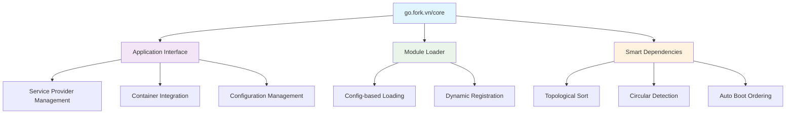
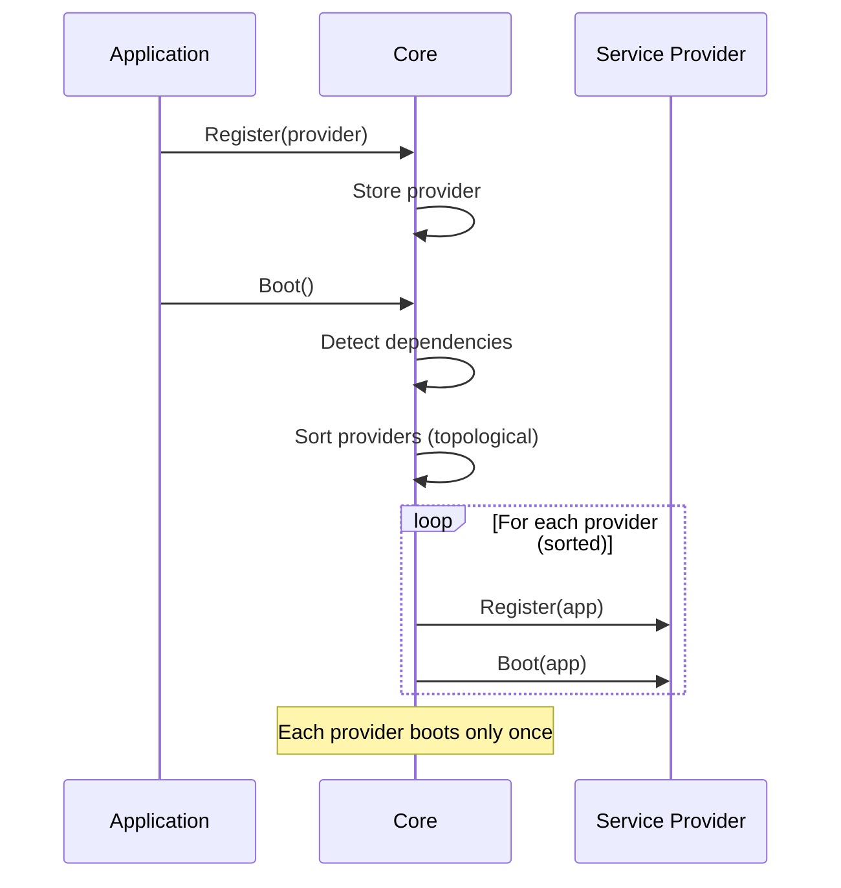
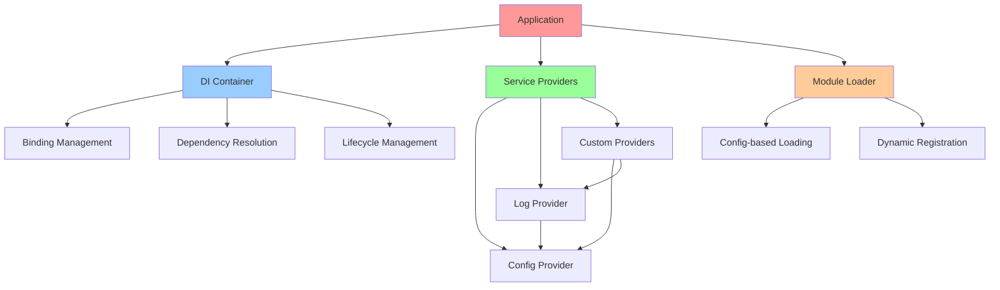

# go.fork.vn/core - Tài liệu Hướng dẫn

**go.fork.vn/core** là package nền tảng của hệ sinh thái go.fork.vn, cung cấp các interface và implementation cốt lõi để xây dựng ứng dụng Go hiện đại với kiến trúc modular và dependency injection.

## 🚀 Tổng quan

Package core cung cấp:
- **Application Framework**: Interface và implementation cho quản lý ứng dụng
- **Smart Dependency Management**: Tự động sắp xếp và quản lý dependencies giữa các service provider
- **Module Loading System**: Hệ thống tải module linh hoạt
- **Service Provider Pattern**: Triển khai chuẩn Service Provider với dependency ordering



## 📋 Mục lục

### 🏗️ **Kiến trúc & Thiết kế**
- [**Tổng quan Hệ thống**](overview.md) - Kiến trúc tổng thể và nguyên tắc thiết kế
- [**Workflows**](workflows.md) - Quy trình hoạt động và dependency management

### 🔧 **Core Components**
- [**Application**](application.md) - Interface và implementation chính
- [**Module Loader**](loader.md) - Hệ thống tải module động
- [**Core Providers**](core_providers.md) - Các provider cốt lõi

## 🎯 Tính năng Chính

### ✨ **Smart Dependency Management**
```go
// Tự động phát hiện và sắp xếp dependencies
app := core.New()
app.Register(&DatabaseProvider{})    // requires: config
app.Register(&CacheProvider{})       // requires: database
app.Register(&ConfigProvider{})      // no dependencies

// Tự động sắp xếp: Config → Database → Cache
app.Boot() // Smart dependency detection và auto-sort
```

### 🔄 **Service Provider Lifecycle**


### 🎨 **Flexible Architecture**
```go
type Application interface {
    // Container access
    Container() di.Container
    
    // Provider management
    Register(provider di.ServiceProvider)
    RegisterServiceProviders() error
    RegisterWithDependencies() error  // Smart dependency ordering
    BootServiceProviders() error
    Boot() error                      // Smart boot with auto-detection
    
    // Binding shortcuts
    Bind(abstract string, concrete di.BindingFunc)
    Singleton(abstract string, concrete di.BindingFunc)
    Instance(abstract string, instance interface{})
    Alias(abstract, alias string)
    
    // Dependency resolution
    Make(abstract string) (interface{}, error)
    MustMake(abstract string) interface{}
    Call(callback interface{}, params ...interface{}) ([]interface{}, error)
}
```

## 🚀 Bắt đầu Nhanh

### 1. **Cài đặt**
```bash
go get go.fork.vn/core
```

### 2. **Sử dụng Cơ bản**
```go
package main

import (
    "go.fork.vn/core"
    "go.fork.vn/config"
    "go.fork.vn/log"
)

func main() {
    // Tạo application với core providers
    app := core.New()
    
    // Đăng ký core providers
    app.Register(&config.ServiceProvider{})
    app.Register(&log.ServiceProvider{})
    
    // Boot application với smart dependency management
    if err := app.Boot(); err != nil {
        panic(err)
    }
    
    // Sử dụng services
    configManager := app.MustMake("config").(config.Manager)
    logger := app.MustMake("log").(log.Manager)
    
    logger.Info("Application started successfully!")
}
```

### 3. **Tạo Custom Service Provider**
```go
type MyServiceProvider struct{}

func (p *MyServiceProvider) Register(app core.Application) {
    app.Singleton("my.service", func(c di.Container) interface{} {
        config := c.MustMake("config").(config.Manager)
        return NewMyService(config)
    })
}

func (p *MyServiceProvider) Boot(app core.Application) {
    service := app.MustMake("my.service").(*MyService)
    service.Initialize()
}

func (p *MyServiceProvider) Requires() []string {
    return []string{"config"} // Yêu cầu config provider trước
}

func (p *MyServiceProvider) Providers() []string {
    return []string{"my.service"}
}
```

## 📊 Dependency Graph



## 🔗 Tích hợp với Ecosystem

Package core được thiết kế để tích hợp liền mạch với toàn bộ hệ sinh thái go.fork.vn:

- **go.fork.vn/config** - Quản lý cấu hình
- **go.fork.vn/log** - Logging framework  
- **go.fork.vn/di** - Dependency injection container
- **go.fork.vn/cache** - Caching solutions
- **go.fork.vn/redis** - Redis integration
- **go.fork.vn/mongodb** - MongoDB integration
- **go.fork.vn/queue** - Background job processing
- **go.fork.vn/scheduler** - Task scheduling
- **go.fork.vn/mailer** - Email services
- **go.fork.vn/templates** - Template rendering
- **go.fork.vn/middleware*** - HTTP middleware collection

## 📈 Performance & Benefits

- **🚀 Fast Boot Time**: Efficient dependency resolution với O(V + E) complexity
- **💾 Memory Efficient**: Zero-allocation service provider key generation
- **🔒 Thread Safe**: Concurrent-safe operations
- **🧪 Test Friendly**: Comprehensive mock support
- **📖 Well Documented**: 93.8% test coverage và extensive documentation

## 📚 Tài liệu Nâng cao

- [**Configuration Sample**](../configs/app.sample.yaml) - File cấu hình tổng hợp
- [**API Reference**](https://pkg.go.dev/go.fork.vn/core) - Tài liệu API chi tiết
- [**Examples**](https://github.com/go-fork/examples) - Ví dụ thực tế
- [**Best Practices**](https://github.com/go-fork/docs/best-practices) - Hướng dẫn best practices

## 🤝 Đóng góp

Chúng tôi hoan nghênh mọi đóng góp! Vui lòng đọc [Contributing Guidelines](../CONTRIBUTING.md) trước khi submit PR.

## 📄 Giấy phép

MIT License - xem [LICENSE](../LICENSE) để biết chi tiết.

---

> **Lưu ý**: Tài liệu này được cập nhật liên tục. Phiên bản mới nhất luôn có sẵn tại [go.fork.vn/core/docs](https://go.fork.vn/core/docs).