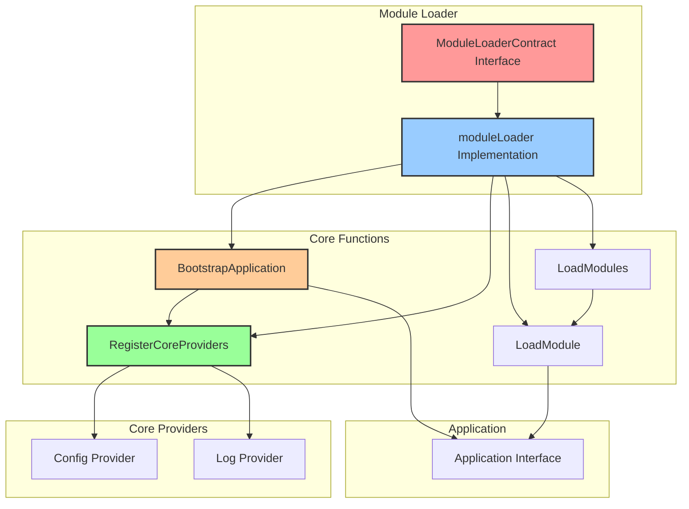
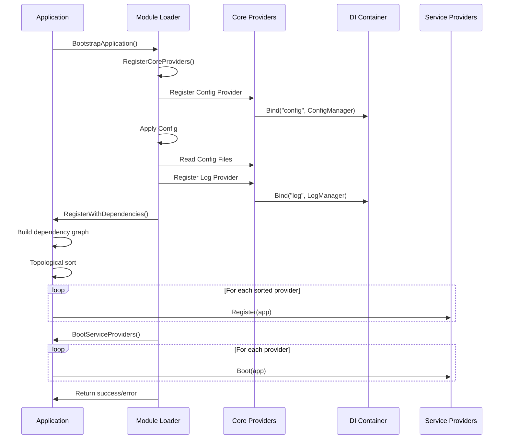

# Hệ thống Module Loader - go.fork.vn/core

## 🎯 Giới thiệu

**Module Loader** là thành phần quan trọng trong go.fork.vn/core, chịu trách nhiệm quản lý quá trình load, bootstrap và điều phối các module trong ứng dụng. Module Loader cung cấp một workflow chuẩn để khởi tạo ứng dụng và quản lý dependency lifecycle.

## 🏗️ Kiến trúc Module Loader



## 🔧 Interface và Implementation

### ModuleLoaderContract Interface

Interface này định nghĩa các phương thức cần thiết để load và quản lý modules trong ứng dụng:

```go
type ModuleLoaderContract interface {
    di.ModuleLoaderContract
}

// Từ di package:
type ModuleLoaderContract interface {
    BootstrapApplication() error
    RegisterCoreProviders() error
    LoadModule(module interface{}) error
    LoadModules(modules ...interface{}) error
}
```

### moduleLoader Implementation

Implementation chính của ModuleLoaderContract:

```go
type moduleLoader struct {
    app Application
}

func newModuleLoader(app Application) ModuleLoaderContract {
    return &moduleLoader{
        app: app,
    }
}
```

## 🔄 Quy trình Bootstrap

### Workflow toàn diện



### BootstrapApplication

Phương thức chính để khởi động toàn bộ application:

```go
func (l *moduleLoader) BootstrapApplication() error {
    // Step 1: Register core providers
    if err := l.RegisterCoreProviders(); err != nil {
        return err
    }

    // Step 2: Register all service providers with dependency checking
    if err := l.app.RegisterWithDependencies(); err != nil {
        return err
    }

    // Step 3: Boot all service providers
    if err := l.app.BootServiceProviders(); err != nil {
        return err
    }

    return nil
}
```

## 🔧 Core Providers

Module Loader chịu trách nhiệm đăng ký các core providers cần thiết cho ứng dụng:

```go
func (l *moduleLoader) RegisterCoreProviders() error {
    // Register config provider
    l.app.Register(config.NewServiceProvider())

    // Register the config provider immediately
    if err := l.app.RegisterServiceProviders(); err != nil {
        return err
    }

    // Apply config after registering config provider
    if err := l.applyConfig(); err != nil {
        return err
    }

    // Register log provider
    l.app.Register(log.NewServiceProvider())

    // Register the log provider immediately
    if err := l.app.RegisterServiceProviders(); err != nil {
        return err
    }

    return nil
}
```

### Config Provider

Config Provider được load trước tiên, cung cấp khả năng quản lý cấu hình ứng dụng:


### Log Provider

Log Provider được load thứ hai, sử dụng cấu hình từ Config Provider:


## 🔄 Module Loading

### LoadModule

Phương thức để load một module riêng lẻ vào application:

```go
func (l *moduleLoader) LoadModule(module interface{}) error {
    // Kiểm tra module có phải ServiceProvider không
    provider, ok := module.(di.ServiceProvider)
    if !ok {
        return &ModuleLoadError{
            Module: module,
            Reason: "module must implement di.ServiceProvider interface",
        }
    }

    // Đăng ký provider
    l.app.Register(provider)

    // Nếu app đã booted, cần register và boot provider mới ngay
    if l.isAppBooted() {
        provider.Register(l.app)
        provider.Boot(l.app)
    }

    return nil
}
```

### LoadModules

Phương thức để load nhiều modules cùng lúc:

```go
func (l *moduleLoader) LoadModules(modules ...interface{}) error {
    for i, module := range modules {
        if err := l.LoadModule(module); err != nil {
            return &MultiModuleLoadError{
                FailedIndex:  i,
                FailedModule: module,
                Cause:        err,
            }
        }
    }
    return nil
}
```

## 🛠️ Error Handling

Module Loader cung cấp error types chi tiết để xử lý các tình huống lỗi:

```go
// ModuleLoadError represent lỗi khi load một module
type ModuleLoadError struct {
    Module interface{}
    Reason string
}

func (e *ModuleLoadError) Error() string {
    return "failed to load module: " + e.Reason
}

// MultiModuleLoadError represent lỗi khi load multiple modules
type MultiModuleLoadError struct {
    FailedIndex  int
    FailedModule interface{}
    Cause        error
}

func (e *MultiModuleLoadError) Error() string {
    return fmt.Sprintf("failed to load modules: error at index %d, module failed: %v", 
        e.FailedIndex, e.Cause)
}
```

## 🧪 Testing Support

Module Loader có mock interface hỗ trợ cho việc testing:

```go
import "go.fork.vn/core/mocks"

func TestWithMocks(t *testing.T) {
    // Tạo mock ModuleLoaderContract
    mockLoader := mocks.NewMockModuleLoaderContract(t)
    
    // Setup expectations
    mockLoader.EXPECT().BootstrapApplication().Return(nil).Once()
    
    // Test với mock
    err := mockLoader.BootstrapApplication()
    assert.NoError(t, err)
}
```

## 🏆 Best Practices

### 1. **Sử dụng Module Loader trong Main Function**

```go
func main() {
    // Create application
    app := core.New()
    
    // Get module loader
    loader := app.ModuleLoader()
    
    // Bootstrap application with standard workflow
    if err := loader.BootstrapApplication(); err != nil {
        log.Fatal("Failed to bootstrap application:", err)
    }
    
    // Application is now ready to use
    fmt.Println("Application started successfully")
}
```

### 2. **Loading Custom Modules**

```go
// Load single module
userModule := &UserServiceProvider{}
if err := loader.LoadModule(userModule); err != nil {
    log.Fatal("Failed to load user module:", err)
}

// Load multiple modules with dependencies
err := loader.LoadModules(
    &DatabaseProvider{},
    &CacheProvider{},
    &APIProvider{},
)
if err != nil {
    log.Fatal("Failed to load modules:", err)
}
```

### 3. **Error Handling**

```go
// Type checking errors
if err := loader.LoadModule(invalidModule); err != nil {
    var moduleErr *core.ModuleLoadError
    if errors.As(err, &moduleErr) {
        log.Printf("Module load error: %s for module type: %T", 
            moduleErr.Reason, moduleErr.Module)
    } else {
        log.Fatal("Unknown error:", err)
    }
}
```

## 📈 Performance Considerations

### Memory Efficiency

Module Loader sử dụng các kỹ thuật sau để tối ưu memory usage:

- Không sao chép providers hoặc modules không cần thiết
- Sử dụng pointers để tránh copy large structures
- Tái sử dụng app instance để tránh duplicate resources

### Lazy Loading

Module Loader hỗ trợ lazy loading modules khi cần thiết:

```go
// Kiểm tra điều kiện trước khi load module
if config.Get("feature.payments.enabled") == true {
    // Chỉ load payment module khi được bật trong config
    loader.LoadModule(payment.NewServiceProvider())
}
```

## 🔮 Roadmap

### Planned Features

- **Dynamic Module Loading**: Load modules từ external sources (plugins)
- **Module Lifecycle Events**: Events khi module được load/unload
- **Module Dependencies**: Khai báo dependencies giữa các modules
- **Module Versioning**: Version compatibility checking

---

> **Next**: [Workflows Documentation](workflows.md) - Chi tiết quy trình hoạt động và dependency management