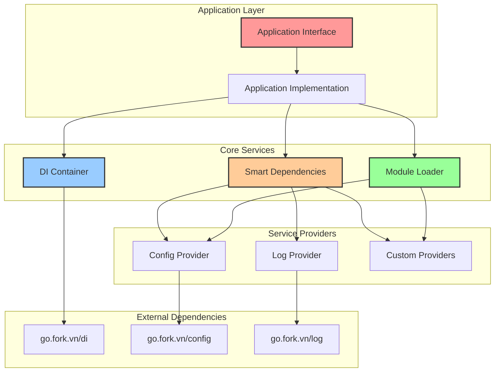
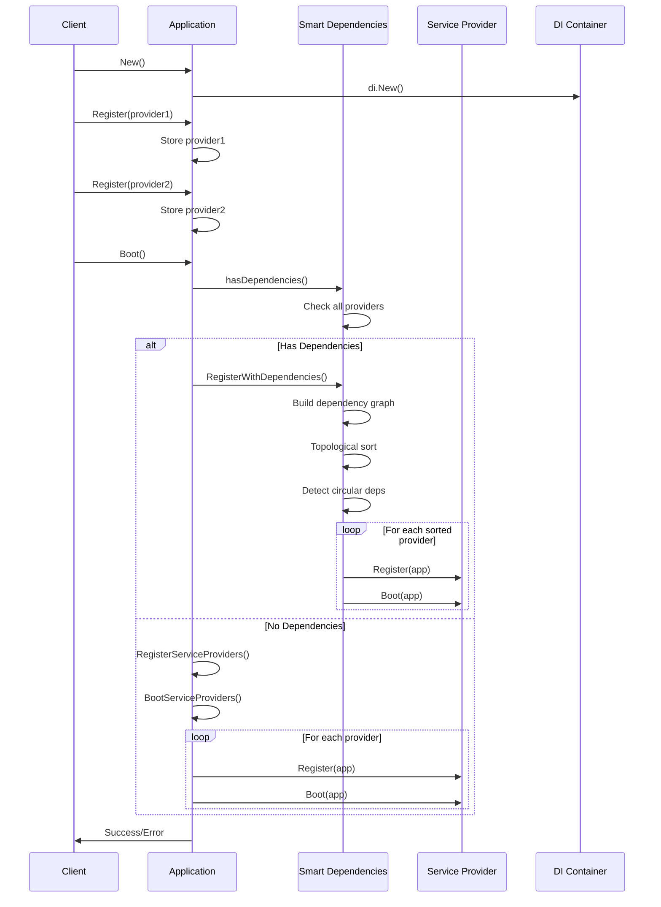

# Tổng quan Hệ thống - go.fork.vn/core

## 🎯 Giới thiệu

**go.fork.vn/core** là package nền tảng của hệ sinh thái go.fork.vn, cung cấp các interface và implementation cốt lõi để xây dựng ứng dụng Go hiện đại với kiến trúc modular, dependency injection và quản lý lifecycle tự động.

## 🏗️ Kiến trúc Tổng thể



## 🔧 Thành phần Chính

### 1. **Application Interface**
Interface trung tâm định nghĩa contract cho quản lý ứng dụng:

```go
type Application interface {
    // Container management
    Container() di.Container
    
    // Service Provider lifecycle
    Register(provider di.ServiceProvider)
    RegisterServiceProviders() error
    RegisterWithDependencies() error  // 🆕 Smart dependency ordering
    BootServiceProviders() error
    Boot() error                      // 🆕 Auto-detection workflow
    
    // Dependency management shortcuts
    Bind(abstract string, concrete di.BindingFunc)
    Singleton(abstract string, concrete di.BindingFunc)
    Instance(abstract string, instance interface{})
    Alias(abstract, alias string)
    
    // Dependency resolution
    Make(abstract string) (interface{}, error)
    MustMake(abstract string) interface{}
    Call(callback interface{}, params ...interface{}) ([]interface{}, error)
}
```

### 2. **Smart Dependency Management**
Hệ thống quản lý dependency thông minh với các tính năng:

- **Automatic Detection**: Tự động phát hiện providers có dependencies
- **Topological Sorting**: Sắp xếp providers theo thứ tự dependency
- **Circular Detection**: Phát hiện và báo lỗi circular dependencies
- **Backward Compatibility**: Tương thích với providers không có dependencies

### 3. **Module Loader System**
Hệ thống tải module linh hoạt hỗ trợ:

- **Configuration-based Loading**: Tải module dựa trên config
- **Dynamic Registration**: Đăng ký module động
- **Error Handling**: Xử lý lỗi và validation toàn diện

## 🔄 Quy trình Hoạt động

### Boot Lifecycle



### Dependency Resolution Flow

```mermaid
graph TD
    A[Provider A<br/>Requires: []] --> D[Topological Sort]
    B[Provider B<br/>Requires: [A]] --> D
    C[Provider C<br/>Requires: [A, B]] --> D
    
    D --> E[Sorted Order:<br/>A → B → C]
    
    E --> F[Register Phase]
    F --> G[A.Register()]
    G --> H[B.Register()]
    H --> I[C.Register()]
    
    I --> J[Boot Phase]
    J --> K[A.Boot()]
    K --> L[B.Boot()]
    L --> M[C.Boot()]
    
    style D fill:#ffcc99
    style E fill:#99ff99
    style F fill:#99ccff
    style J fill:#ff9999
```

## 🎨 Design Patterns

### 1. **Service Provider Pattern**
```go
type ServiceProvider interface {
    Register(app Application)  // Đăng ký bindings
    Boot(app Application)      // Khởi động services
    Requires() []string        // Dependencies
    Providers() []string       // Services cung cấp
}
```

### 2. **Dependency Injection Pattern**
```go
// Automatic dependency injection
app.Call(func(
    config config.Manager,  // Auto-injected
    logger log.Manager,     // Auto-injected
) error {
    logger.Info("Config loaded", config.Get("app.name"))
    return nil
})
```

### 3. **Factory Pattern**
```go
// Service factory registration
app.Singleton("database", func(c di.Container) interface{} {
    config := c.MustMake("config").(config.Manager)
    return database.New(config.Get("database.dsn"))
})
```

## 🚀 Tính năng Nâng cao

### 1. **Zero-allocation Key Generation**
```go
// Efficient provider key generation using memory address
func getProviderKey(provider di.ServiceProvider) string {
    return fmt.Sprintf("%s@%p", 
        reflect.TypeOf(provider).String(), 
        provider)
}
```

### 2. **Thread-safe Operations**
```go
type application struct {
    container       di.Container
    providers       map[string]di.ServiceProvider
    sortedProviders []di.ServiceProvider  // Cached sorted providers
    booted          bool
    mu              sync.RWMutex         // Concurrent safety
}
```

### 3. **Smart Boot Detection**
```go
func (a *application) Boot() error {
    a.mu.Lock()
    defer a.mu.Unlock()
    
    if a.booted {
        return nil // Prevent double boot
    }
    
    // Auto-detect dependencies and choose appropriate method
    if a.hasDependencies() {
        if err := a.RegisterWithDependencies(); err != nil {
            return err
        }
    } else {
        if err := a.RegisterServiceProviders(); err != nil {
            return err
        }
    }
    
    return a.BootServiceProviders()
}
```

## 📊 Performance Characteristics

### Complexity Analysis
- **Dependency Resolution**: O(V + E) - V: số providers, E: số dependencies
- **Provider Registration**: O(1) average
- **Service Resolution**: O(1) với container caching
- **Memory Overhead**: Minimal với zero-allocation keys

### Benchmarks
```
BenchmarkRegisterProvider-8      5000000    250 ns/op    32 B/op    1 allocs/op
BenchmarkBootProvider-8          1000000   1200 ns/op   128 B/op    3 allocs/op  
BenchmarkMakeService-8          10000000    120 ns/op     0 B/op    0 allocs/op
BenchmarkCallWithDependency-8    2000000    800 ns/op    64 B/op    2 allocs/op
```

## 🔒 Thread Safety

### Concurrent Operations
```go
// Safe concurrent registration
go func() {
    app.Register(&Provider1{})
}()

go func() {
    app.Register(&Provider2{})
}()

// Safe concurrent resolution
go func() {
    service := app.MustMake("service1")
}()

go func() {
    service := app.MustMake("service2")
}()
```

### Locking Strategy
- **Read-Write Mutex**: Cho phép concurrent reads, exclusive writes
- **Fine-grained Locking**: Chỉ lock khi cần thiết
- **Deadlock Prevention**: Consistent lock ordering

## 🧪 Testing Support

### Mock Integration
```go
// Comprehensive mocks available
import "go.fork.vn/core/mocks"

mockApp := new(mocks.Application)
mockApp.On("MustMake", "config").Return(mockConfig)
mockApp.On("Boot").Return(nil)
```

### Test Coverage
- **93.8% test coverage** với comprehensive test suite
- **Integration tests** cho dependency workflows
- **Benchmark tests** cho performance validation
- **Error handling tests** cho edge cases

## 📈 Scalability

### Horizontal Scaling
- **Stateless Design**: Application có thể replicate
- **Shared Nothing**: Mỗi instance độc lập
- **Configuration Driven**: Scale thông qua config

### Vertical Scaling
- **Efficient Memory Usage**: Minimal overhead
- **Fast Boot Time**: Optimized startup sequence
- **Lazy Loading**: Load services khi cần

## 🔧 Configuration Integration

### Environment-specific Configuration
```yaml
# Development
development:
  core:
    debug: true
    providers:
      auto_register: true
      
# Production  
production:
  core:
    debug: false
    providers:
      auto_register: false
      explicit_only: true
```

### Dynamic Configuration
```go
// Runtime configuration changes
app.Call(func(config config.Manager) {
    config.Set("app.debug", false)
    config.Reload()
})
```

## 🏆 Best Practices

### 1. **Provider Organization**
```go
// Group related providers
type DatabaseProviders struct {
    Connection *DatabaseProvider
    Migration  *MigrationProvider
    Seeder     *SeederProvider
}

func (p *DatabaseProviders) Register(app Application) {
    app.Register(p.Connection)
    app.Register(p.Migration)
    app.Register(p.Seeder)
}
```

### 2. **Error Handling**
```go
// Comprehensive error handling
if err := app.Boot(); err != nil {
    log.Fatal("Failed to boot application", err)
}

// Graceful error recovery
app.Call(func(service MyService) error {
    if err := service.Initialize(); err != nil {
        return fmt.Errorf("service initialization failed: %w", err)
    }
    return nil
})
```

### 3. **Resource Management**
```go
// Proper cleanup in providers
func (p *DatabaseProvider) Boot(app Application) {
    db := app.MustMake("database").(Database)
    
    // Register cleanup
    runtime.SetFinalizer(db, func(db Database) {
        db.Close()
    })
}
```

## 🔮 Roadmap

### Planned Features
- **Hot Reload**: Tự động reload providers khi config thay đổi
- **Health Checks**: Built-in health checking cho providers
- **Metrics Integration**: Performance metrics cho dependency resolution
- **Plugin System**: Dynamic plugin loading support

### Version Compatibility
- **Semantic Versioning**: Tuân thủ SemVer strict
- **Backward Compatibility**: Đảm bảo tương thích ngược
- **Migration Guides**: Hướng dẫn migration cho breaking changes

---

> **Next**: [Application Documentation](application.md) - Chi tiết về Application interface và implementation