# Workflows và Dependency Management - go.fork.vn/core

## 🎯 Giới thiệu

**Workflows** trong go.fork.vn/core là các quy trình hoạt động cốt lõi xử lý vòng đời của application, service providers, và dependency management. Hệ thống workflows đảm bảo các thành phần được khởi tạo, đăng ký và boot theo đúng thứ tự dependency.

## 🏗️ Kiến trúc Workflows

```mermaid
graph TB
    Start[Khởi tạo Application]
    RegisterProviders[Register Providers]
    DetectDeps[Detect Dependencies]
    SortDeps[Sort Dependencies]
    RegisterWithDeps[Register With Dependencies]
    RegisterNormal[Register Normal]
    BootProviders[Boot Providers]
    AppRunning[Application Running]
    
    Start --> RegisterProviders
    RegisterProviders --> DetectDeps
    
    DetectDeps -->|Has Dependencies| SortDeps
    DetectDeps -->|No Dependencies| RegisterNormal
    
    SortDeps --> RegisterWithDeps
    RegisterWithDeps --> BootProviders
    RegisterNormal --> BootProviders
    
    BootProviders --> AppRunning
    
    style Start fill:#ff9999,stroke:#333,stroke-width:2px
    style DetectDeps fill:#ffcc99,stroke:#333,stroke-width:2px
    style SortDeps fill:#99ff99,stroke:#333,stroke-width:2px
    style BootProviders fill:#99ccff,stroke:#333,stroke-width:2px
    style AppRunning fill:#cc99ff,stroke:#333,stroke-width:2px
```



## 🔄 Application Lifecycle Workflows

### 1. **Initialization Workflow**


### 2. **Provider Registration Workflow**


### 3. **Smart Registration Workflow**


### 4. **Boot Workflow**


## 🧩 Dependency Management

### 1. **Dependency Graph Construction**

```mermaid
graph TD
    A[Provider A<br/>Requires: []]
    B[Provider B<br/>Requires: [A]]
    C[Provider C<br/>Requires: [A, B]]
    D[Provider D<br/>Requires: [A]]
    
    A --> B
    A --> D
    B --> C
    A -.-> C
    
    style A fill:#ff9999,stroke:#333,stroke-width:2px
    style B fill:#ffcc99,stroke:#333,stroke-width:2px
    style C fill:#99ff99,stroke:#333,stroke-width:2px
    style D fill:#99ccff,stroke:#333,stroke-width:2px
```

### 2. **Topological Sort Algorithm**


### 3. **Dependency Resolution Code**

```go
func (a *application) RegisterWithDependencies() error {
    a.mu.Lock()
    defer a.mu.Unlock()
    
    if len(a.providers) == 0 {
        return nil
    }
    
    // Build dependency graph from providers
    graph, err := a.buildDependencyGraph()
    if err != nil {
        return err
    }
    
    // Sort providers by dependency order
    sorted, err := a.topologicalSort(graph)
    if err != nil {
        return fmt.Errorf("dependency resolution failed: %w", err)
    }
    
    // Cache sorted providers for future use
    a.sortedProviders = sorted
    
    // Register providers in dependency order
    for _, provider := range sorted {
        if err := provider.Register(a); err != nil {
            return fmt.Errorf("provider registration failed: %w", err)
        }
    }
    
    return nil
}
```

### 4. **Circular Dependency Detection**

```mermaid
graph TD
    A[Provider A<br/>Requires: [C]]
    B[Provider B<br/>Requires: [A]]
    C[Provider C<br/>Requires: [B]]
    
    A --> B
    B --> C
    C --> A
    
    style A fill:#ff9999,stroke:#333,stroke-width:2px
    style B fill:#ffcc99,stroke:#333,stroke-width:2px
    style C fill:#99ff99,stroke:#333,stroke-width:2px
    
    ERROR[Circular Dependency Detected!<br/>A → B → C → A] 
    style ERROR fill:#ff0000,stroke:#333,stroke-width:2px,color:#ffffff
```

## 🔧 Service Provider Lifecycle

### 1. **Registration Phase**

```go
// Provider Implementation Example
func (p *MyProvider) Register(app core.Application) error {
    // Step 1: Register bindings
    app.Singleton("my-service", func(c di.Container) interface{} {
        return &MyService{
            config: c.MustMake("config").(config.Manager),
            logger: c.MustMake("log").(log.Manager),
        }
    })
    
    // Step 2: Register any subproviders
    app.Register(&MySubProvider{})
    
    return nil
}
```

### 2. **Boot Phase**

```go
// Provider Implementation Example
func (p *MyProvider) Boot(app core.Application) error {
    // Step 1: Resolve service instance
    service := app.MustMake("my-service").(*MyService)
    
    // Step 2: Initialize the service
    if err := service.Initialize(); err != nil {
        return err
    }
    
    // Step 3: Register cleanup if needed
    runtime.SetFinalizer(service, func(s *MyService) {
        s.Cleanup()
    })
    
    return nil
}
```

### 3. **Dependency Declaration**

```go
// Provider Implementation Example
func (p *MyProvider) Requires() []string {
    // Declare dependencies on other providers
    return []string{
        "config",     // Require config provider
        "log",        // Require log provider
        "database",   // Require database provider
    }
}

func (p *MyProvider) Providers() []string {
    // Declare services this provider offers
    return []string{
        "my-service", // This provider offers my-service
        "my-utility", // This provider offers my-utility
    }
}
```

## 🧪 Edge Cases và Xử lý Lỗi

### 1. **Boot Errors**


### 2. **Missing Dependencies**

```mermaid
graph TD
    A[Provider A<br/>Requires: [X]]
    B[Provider B<br/>Requires: [A]]
    
    A --> X[X: Missing Provider]
    A --> B
    
    style A fill:#ff9999,stroke:#333,stroke-width:2px
    style B fill:#ffcc99,stroke:#333,stroke-width:2px
    style X fill:#ff0000,stroke:#333,stroke-width:2px,color:#ffffff
    
    ERROR[Error: Dependency "X" not found<br/>Required by "Provider A"] 
    style ERROR fill:#ff0000,stroke:#333,stroke-width:2px,color:#ffffff
```

### 3. **Runtime Provider Loading**


## 🏆 Best Practices

### 1. **Modular Provider Structure**

```go
// Group related providers
type DatabaseProviders struct {
    Connection *DatabaseConnectionProvider
    Migration  *DatabaseMigrationProvider
    Seeder     *DatabaseSeederProvider
}

func (p *DatabaseProviders) Register(app core.Application) {
    app.Register(p.Connection)
    app.Register(p.Migration)
    app.Register(p.Seeder)
}

func (p *DatabaseProviders) Requires() []string {
    return []string{"config", "log"}
}

func (p *DatabaseProviders) Providers() []string {
    return []string{"database", "migration", "seeder"}
}
```

### 2. **Defensive Dependency Loading**

```go
func (p *MyProvider) Register(app core.Application) error {
    // Get required service safely
    configInterface, err := app.Make("config")
    if err != nil {
        return fmt.Errorf("config service not available: %w", err)
    }
    
    // Type assertion with validation
    config, ok := configInterface.(config.Manager)
    if !ok {
        return fmt.Errorf("invalid config service type: expected config.Manager, got %T", configInterface)
    }
    
    // Now use the config service safely
    dsn := config.GetString("database.dsn")
    
    // Register our service with the valid config
    app.Singleton("my-service", func(c di.Container) interface{} {
        return &MyService{config: config}
    })
    
    return nil
}
```

### 3. **Phased Registration**

```go
func (p *ComplexProvider) Register(app core.Application) error {
    // Phase 1: Register basic services
    if err := p.registerBasicServices(app); err != nil {
        return err
    }
    
    // Phase 2: Register dependent services
    if err := p.registerDependentServices(app); err != nil {
        return err
    }
    
    // Phase 3: Register advanced services
    if err := p.registerAdvancedServices(app); err != nil {
        return err
    }
    
    return nil
}
```

## 📈 Performance Optimization

### 1. **Cached Provider Sorting**

```go
func (a *application) RegisterWithDependencies() error {
    a.mu.Lock()
    defer a.mu.Unlock()
    
    // Use cached sorted providers if available
    if len(a.sortedProviders) > 0 {
        // If no providers added since last sort, use cached result
        if len(a.sortedProviders) == len(a.providers) {
            for _, provider := range a.sortedProviders {
                if err := provider.Register(a); err != nil {
                    return err
                }
            }
            return nil
        }
    }
    
    // Otherwise do full dependency sort
    // ...
}
```

### 2. **Lazy Provider Resolution**

```go
func (a *application) lazyRegisterProvider(name string) error {
    a.mu.RLock()
    defer a.mu.RUnlock()
    
    for _, provider := range a.providers {
        if slices.Contains(provider.Providers(), name) {
            if err := provider.Register(a); err != nil {
                return err
            }
            return nil
        }
    }
    
    return fmt.Errorf("no provider found for service: %s", name)
}
```

## 🔮 Roadmap

### Planned Features

- **Tự động phát hiện provider cycles** trong compile time
- **Conditional Providers** - Providers chỉ được load khi điều kiện được thỏa mãn
- **Named Provider Instances** - Support cho nhiều instances cùng provider type
- **Tagging và Grouping** - Providers và services có thể được tag và group

---

> **Next**: [Core Providers Documentation](core_providers.md) - Chi tiết về các core providers cốt lõi